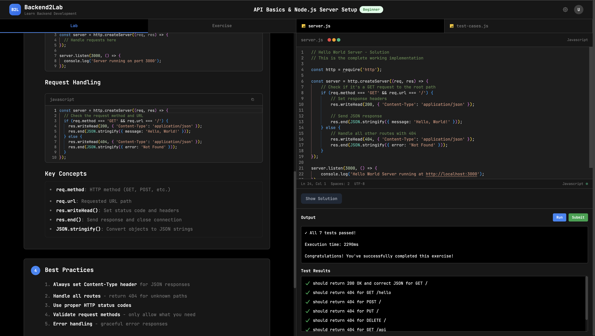

# Backend Playground



Backend Playground is an **interactive learning platform** for backend development.
It combines **labs**, **exercises**, and a **code playground** for beginners to practice backend concepts in a real Node.js environment, directly from the browser.

## Quick Start

### Prerequisites
- Node.js (v18 or higher)
- pnpm (recommended) or npm

### Start All Services (Recommended)
```bash
# Install all dependencies
pnpm install

# Start both client and server simultaneously
pnpm run dev
```

This will start:
- **Client** at `http://localhost:4200`
- **Server** at `http://localhost:4000`

### Start Services Separately

#### Start the Backend Server only
```bash
cd server
pnpm install
pnpm run dev
```
The server will be available at `http://localhost:4000`

#### Start the Frontend Client only
```bash
cd client
pnpm install
pnpm run dev
```
The client will be available at `http://localhost:4200`


## Development

### Building for Production

**Build both client and server:**
```bash
pnpm run build
```

**Build individually:**
```bash
# Frontend
cd client
pnpm run build

# Backend
cd server
pnpm run build
pnpm start
```

### Running Tests

**Run all tests:**
```bash
pnpm run test
```

**Run tests individually:**
```bash
# Backend tests
cd server
pnpm test

# Frontend linting
cd client
pnpm run lint
```

## Project Structure

- **`client/`** - React frontend application
- **`server/`** - Express.js backend API server

Each application can be deployed independently to different platforms.

## Contributing

1. Fork the repository
2. Create a feature branch
3. Make your changes
4. Test both client and server
5. Submit a pull request again the dev branch

## License

This project is licensed under the MIT License.
